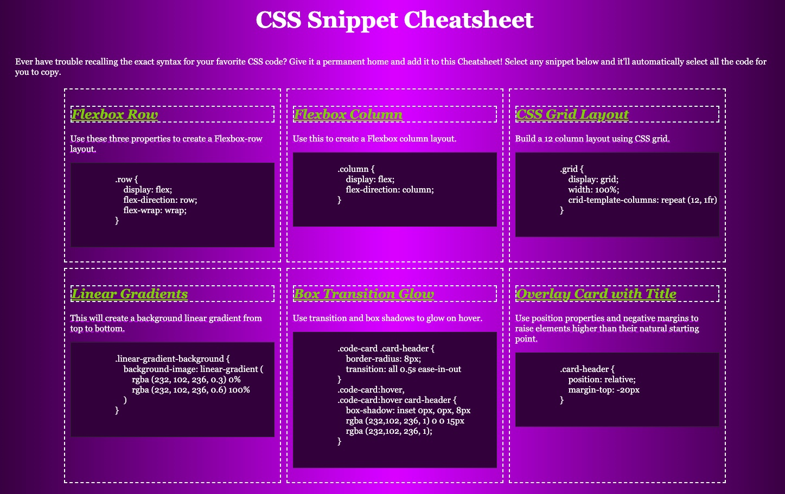

# Wills-Portfolio-Page
Who is Will Seban?

## Site Picture

Deployed Link
https://wseban.github.io/Wills-Portfolio-Page/


## Technologies Used
- HTML - Builds the basic struction and content of the site.  Utilized semantic HTML.
- CSS - Builds upon a basic HTML structure by styling the page.  Utilized flex, flexbox and media quaries to enhance the design and dynamic accessibility of my portfolio.
- Git - Git is what I used to work on my personal computer and pushing my work to GitHub.
- GitHub - A cloud based repository that holds my saved code reserved for resetting my personal computeror deployment.

## Description

The purpose of this portfolio was to utilize our skills with HTML and advanced Cascading Style Sheets(CSS) in order to show a future employer our skills as web developers.  As well as including examples of previous work, a potential employer could use the actual portfolio webpage itself, to assess our skills with CSS.  The objective was to make a dynamic and interactive portfolio page that moved the user to where they desired based on a click of the cursor.  Furthermore, the webpage changes based on screen size, making it more accessible to the user on small tablets.

## Installation

NA

## Usage

A potential employer could assess the content and code of both, the examples linked to my portfolio, and the portfolio webpage itself as proof of my knowledge of the two languages.

## Code Snippets
HTML
```html
<header id="top">
        <h1>William Seban</h1>
        <h2>*Full Stack Web Developer*</h2>
        <nav class="menu">
                <p>
                    <a href="#about">About Me</a>
                </p>
                <p>
                    <a href="#projects">Projects</a>
                </p>
                <p>
                    <a href="#contact">Contact Me</a>
                </p>
        </nav>
    </header>
    <main>
        <section id="about">
            
            <p>
            <span>About Me!</span><br>
             Full Stack Web developer, business professional and prior Army Captain with a, previously held, top-secret security clearance and 12 years of leadership experience. 
                Respected leader, organizer, and manager, able to plan and implement programs for short and long term objectives. 
                Experienced in HTML, Cascading Style Sheets (CSS), Javascript, and project management.<br>
            </p>
        </section>
        <section id="projects">
            <h3>Please view some of my work!</h3>
            <section class="refactor">
                <a href="https://wseban.github.io/refactor-horiseon/"></a>
                <p>Refactoring!<br>Cleaning existing code</p>
                </section>
            <section class="colab">
                <a href="https://thedomconrad.github.io/mini-make2/"></a>
                <p>CSS Worksheet!<br>Worked with a partner to <br>create a CSS help guide</p>
                </section>
            <section class="placeholder">
                <a href="#"></a>
                <p>Placeholder!<br>This image is ment to<br>placehold for future projects.</p>
            </section>
        </section>
    </main>
```
CSS-Cursor:    
```CSS
    a:hover {
    cursor: grab;
    color: var(--p1);
    background-color: var(--p2);
    }
    a:active {
    color: var(--link-active);
    }
```
CSS-Snippet
```CSS
    #about {
   display: flex;
    padding: 50px;
    }
    #about {
   display: flex;
    padding: 50px;  
    }
    #about p {
    width: 70%;
   padding-left: 50px;
    padding-top: 10px;
    }
    p span {
    font-size: 30px;
    font-style: italic;
    font-weight: bold;
    }
    #about img {
    height: 300px;
    width: 300px;
    border-radius: 30px;
    box-shadow: 10px -10px var(--p2);
    z-index: 1;
    flex-shrink: 0;
    }
```
CSS-Media Quaries
```css
    @media screen and (max-width: 600px) {
    #about {
        display: block;
    }
    }
```
## Credits

NA

## License
Please refer to the LICENSE in the Repo.
